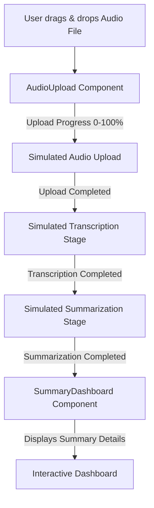

# Architecture: AI Meeting Summarizer

This document details the architectural layout, component layers, and state pipeline for the AI Meeting Summarizer web application. The project is designed with a scalable structure, separating the presentation layer from the service integrations, enabling easy additions of speech-to-text (STT) and large language models (LLM).

---

## 1. Directory Structure

The project follows a clean Next.js App Router structure:

```
my-ai-meeting-summarizer/
├── ARCHITECTURE.md                  # This architecture document
├── app/
│   ├── layout.tsx                   # Global layout, fonts, and HTML wrappers
│   ├── page.tsx                     # Main dashboard page containing upload and results
│   ├── globals.css                  # Tailwind CSS v4 entry point & design tokens
│   └── api/
│       ├── transcribe/route.ts      # Stub for transcription service (Whisper API)
│       └── summarize/route.ts       # Stub for summary generation service (Gemini API)
├── components/
│   ├── AudioUpload.tsx              # Drag-and-drop audio uploader component
│   ├── SummaryDashboard.tsx         # Comprehensive meeting summary viewer component
│   └── ui/
│       └── Card.tsx                 # Sleek glassmorphic container component
├── lib/
│   ├── utils.ts                     # Tailwind class merge helper (cn)
│   └── mockData.ts                  # High-fidelity mock summaries for demo pipeline
└── types/
    └── index.ts                     # Shared TypeScript interface definitions
```

---

## 2. Component Architecture & Data Flow

The app operates via a sequential pipeline designed to provide real-time updates to the user:



### Flow Breakdown

1. **AudioUpload**:
   - Manages HTML5 Drag-and-Drop events (`onDragOver`, `onDragLeave`, `onDrop`).
   - Filters files to ensure compatibility (`.mp3`, `.wav`, `.m4a`, `.webm`).
   - Signals progress using React state hook to drive progress animation.

2. **Processing Orchestrator**:
   - Coordinates transition between upload, transcription, and summary extraction stages.
   - For this demo, a timer-based simulation drives these steps to model a real API response.

3. **SummaryDashboard**:
   - Visualizes the meeting output.
   - Key layout sections:
     - **Overview / Quick Summary**: High-level abstract of the meeting.
     - **Key Decisions**: Bullet points of agreements.
     - **Action Items**: Checkbox items tracking ownership and deadlines.
     - **Full Transcript**: Timeline view of speakers with timestamps.

---

## 3. Design System & Aesthetics

We employ a custom modern dark-mode aesthetic with **glassmorphism** details:
- **Theme**: Ambient dark theme with a deep background (`#030303`) layered with subtle radial gradients.
- **Accents**: Vibrant, high-contrast violet-to-cyan indigo gradients for buttons, hover transitions, and progress bars.
- **Glassmorphism**: Translucent panels utilizing `backdrop-blur-md`, fine white borders (`border-white/10`), and soft drop shadows to create layering.
- **Animations**: CSS transitions (`duration-300`, `ease-out`) for drag & drop hover interactions, checkbox selections, and pipeline step progress.
